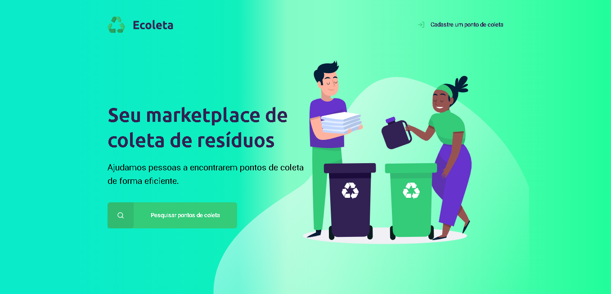
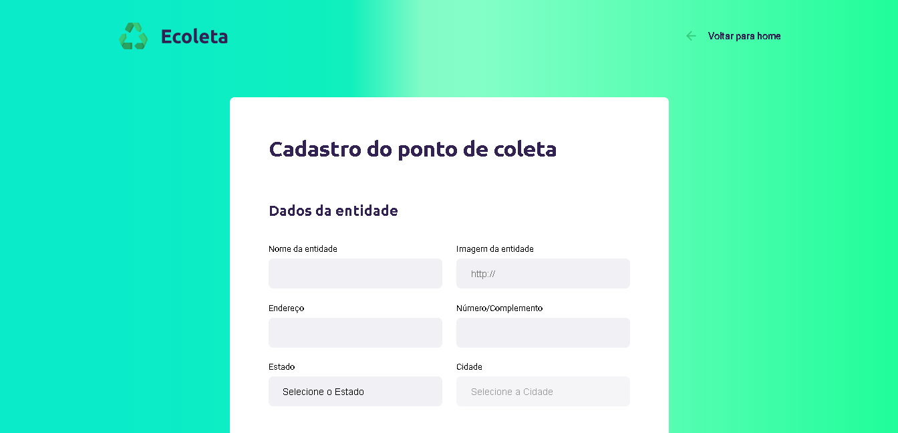
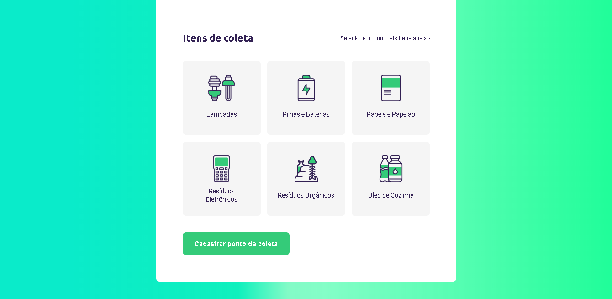
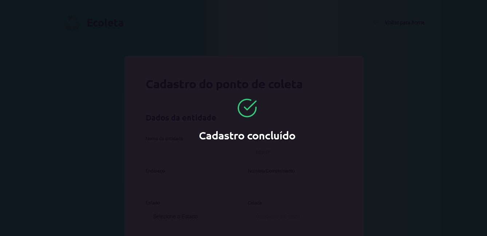
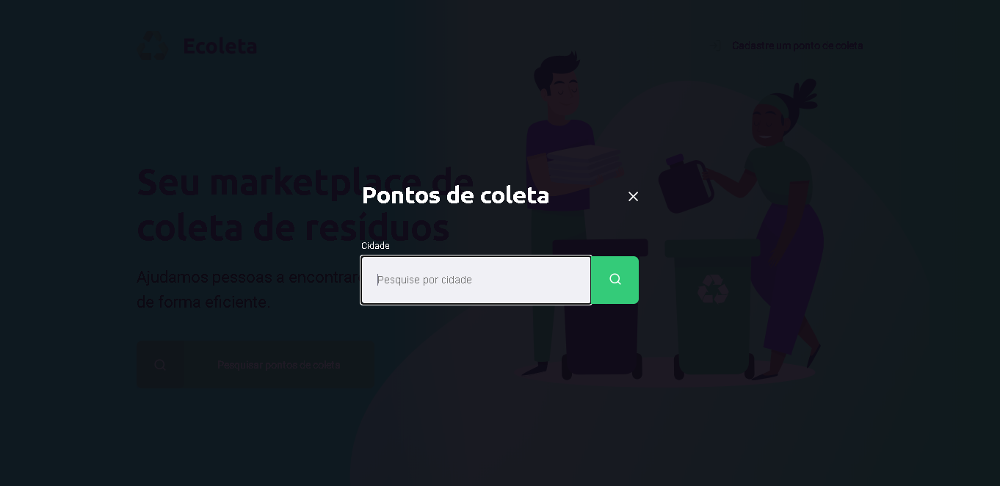
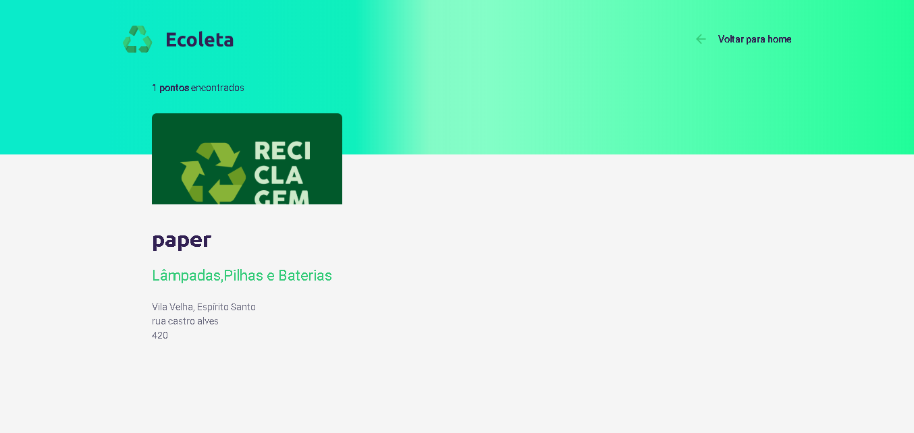

<h1 align="center">
    
    
</h1>

<h3 align="center">Next Level Week</h3>

  Aplicação para registro e busca de locais destinados a coleta seletiva

 

## Tecnologias

Esse projeto foi desenvolvido com as seguintes tecnologias:

- [Node.js](https://nodejs.org/en/)
- [SQLite3](https://www.sqlite.org/index.html)
- [Express](https://expressjs.com/pt-br/)
- [HTMl5](https://developer.mozilla.org/pt-BR/docs/Web/HTML)
- [CSS3](https://developer.mozilla.org/pt-BR/docs/Archive/CSS3)

## Projeto

A aplicação foi desenvolvida durante a primeira Next Level Week da Rocktseat na trilha starter, ministrada por Mayk Brito, 
com objetivo de praticar os conceitos mais básicos de desenvolvimento web.

## Layout

  
  
  
  
  
  

---

Feito por Victor Premoli [Me encontre no Linkedin!](https://www.linkedin.com/in/victorpremoli/)
